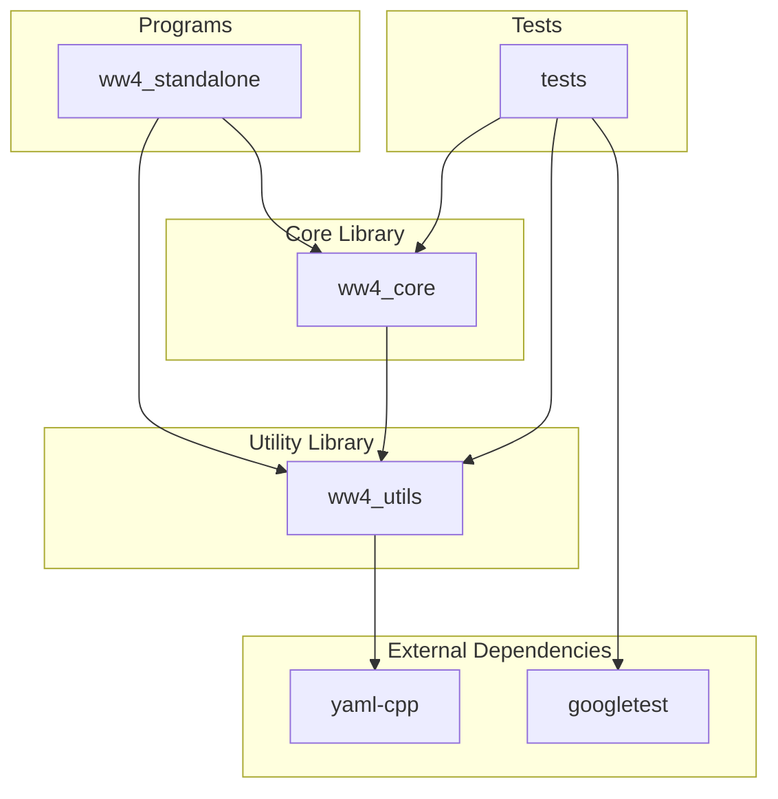
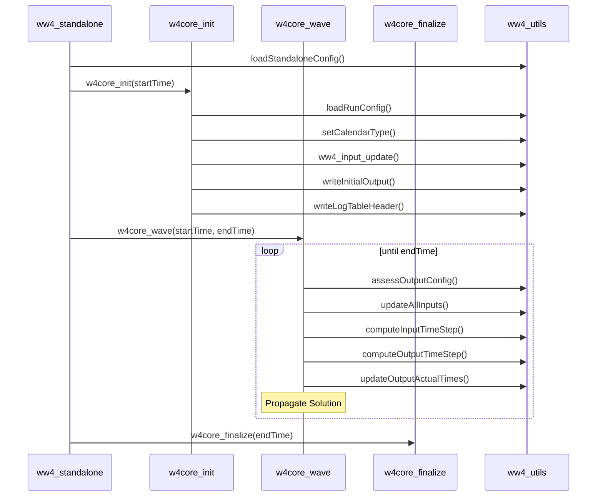
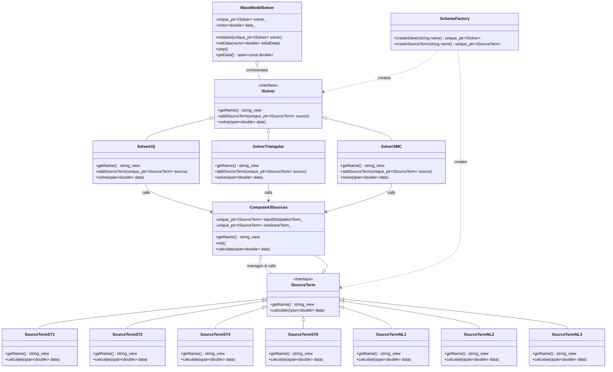

# WAVEWATCH IV Architecture

### Key Components

1.  **ISolver**: The primary integration strategy. It defines the contract for numerical solvers that combine dynamics (propagation) and physics (source terms) to advance the model state.
2.  **ISourceTerm**: The physical strategy interface for WAVEWATCH IV sub-source terms.
3.  **Source Term Implementations**:
    - **ComputeAllSources**: Unified routine called directly by each solver. Manages and executes physical `ISourceTerm` sub-source terms instantiated via `SchemeFactory`.
    - **Input and Dissipation**: `SourceTermST1` (ST1), `SourceTermST2` (ST2), `SourceTermST4` (ST4), and `SourceTermST6` (ST6).
    - **Nonlinear Interactions**: `SourceTermNL1` (NL1), `SourceTermNL2` (NL2), and `SourceTermNL3` (NL3).
4.  **Solvers (`SolverUQ`, `SolverTriangular`, `SolverSMC`)**: Concrete numerical solvers (Ultimate Quickest regular grid, Triangular unstructured grid, and SMC grid) that directly invoke `ComputeAllSources` during their `solve` phase.
5.  **SchemeFactory**: Responsible for instantiating individual model components (solvers and source terms).
6.  **WaveModelSolver**: The high-level orchestrator solver. It manages the simulation loop and triggers the configured solver at each time step.
This document describes the high-level architecture of WAVEWATCH IV (WW4) using a Mermaid diagram.

## Component Diagram

## Call Structure

The following diagram illustrates the sequence of function calls when running the `ww4_standalone` program.

## Description of Components

- **Programs**: Contains end-user applications. `ww4_standalone` is a simplified environment for running the wave model core.
- **Core Library (`ww4_core`)**: Implements the main wave model routines, including initialization (`w4core_init`), time stepping (`w4core_wave`), and finalization (`w4core_finalize`).
- **Utility Library (`ww4_utils`)**: Provides common functionality such as time management, configuration loading, logging, and standard output utilities.
- **Tests**: Contains unit tests (Level 1, prefixed with `L1_test_`) and integration tests (Level 2, prefixed with `L2_test_`) using the Google Test framework.
- **External Dependencies**:
    - `yaml-cpp`: Used for parsing YAML configuration files.
    - `googletest`: Used for unit and integration testing.

## Integrated Runtime Solver Selection

WW4 uses an integrated **Strategy** and **Factory** design pattern. To support complex interleaving of physics and dynamics (e.g., implicit sub-stepping), physical source terms are managed and called directly by a **Solver**.

