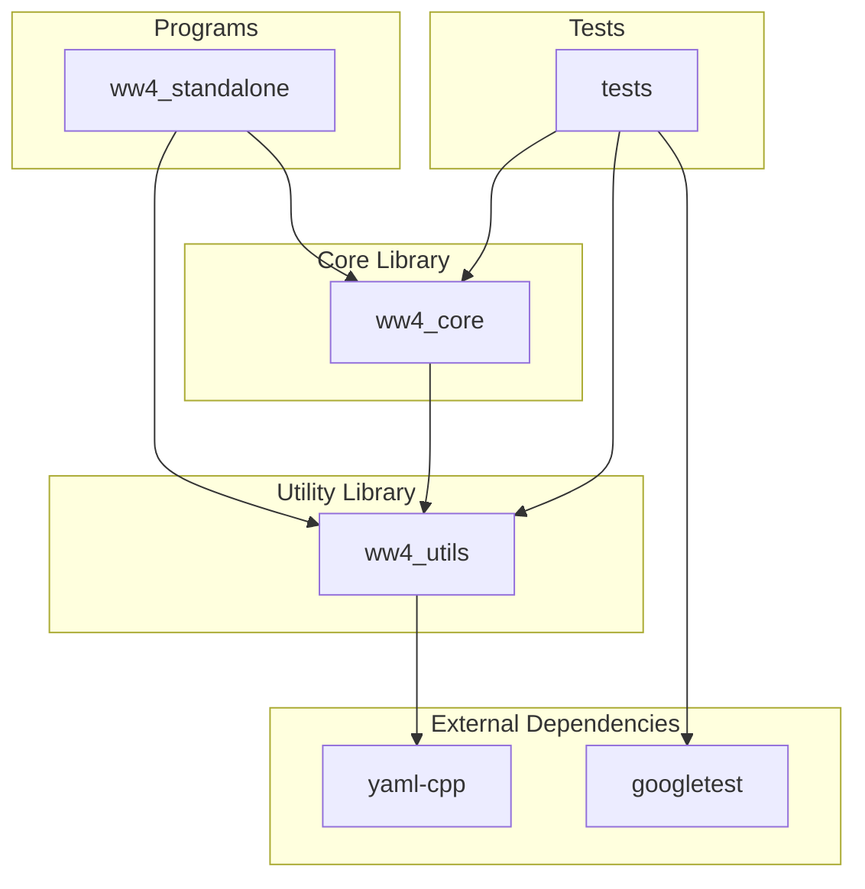
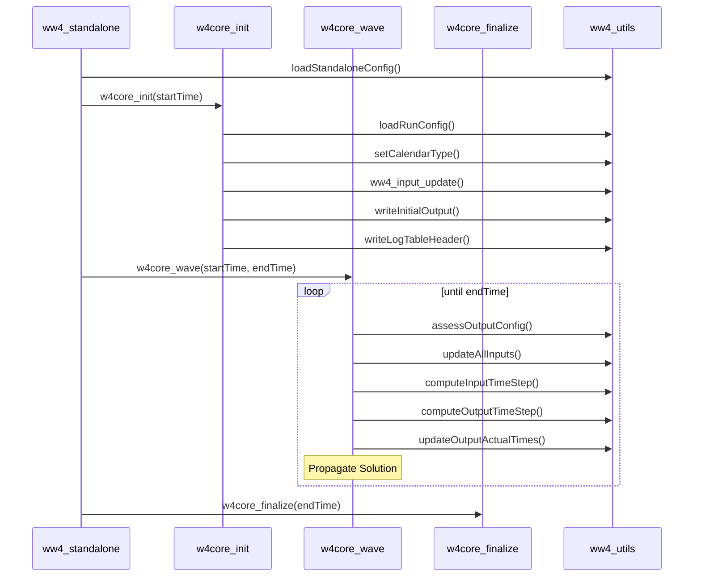

# WAVEWATCH IV Architecture

This document describes the high-level architecture of WAVEWATCH IV (WW4) using a Mermaid diagram.

## Component Diagram

## Call Structure

The following diagram illustrates the sequence of function calls when running the `ww4_standalone` program.

## Description of Components

- **Programs**: Contains end-user applications. `ww4_standalone` is a simplified environment for running the wave model core.
- **Core Library (`ww4_core`)**: Implements the main wave model routines, including initialization (`w4core_init`), time stepping (`w4core_wave`), and finalization (`w4core_finalize`).
- **Utility Library (`ww4_utils`)**: Provides common functionality such as time management, configuration loading, logging, and standard output utilities.
- **Tests**: Contains unit tests (Level 1, prefixed with `L1_test_`) and integration tests (Level 2, prefixed with `L2_test_`) using the Google Test framework.
- **External Dependencies**:
    - `yaml-cpp`: Used for parsing YAML configuration files.
    - `googletest`: Used for unit and integration testing.
