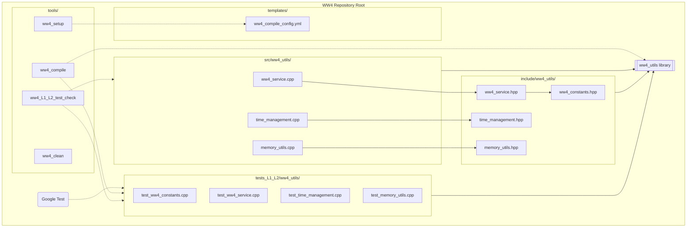

# WAVEWATCH IV (WW4) Code Architecture

This document provides a graphical representation of the WW4 code architecture and its components.

## Component Descriptions

- **ww4_utils**: The core utility library containing mathematical constants, service routines, time management, and memory utilities.
- **include/ww4_utils/**: Public header files for the library.
- **src/ww4_utils/**: Implementation files for the library.
- **tests_L1_L2/**: Unit and integration tests for all components, using the Google Test framework.
- **tools/**: Micro-tools for project configuration, compilation, and maintenance.
- **templates/**: Configuration templates used by the setup tools.
