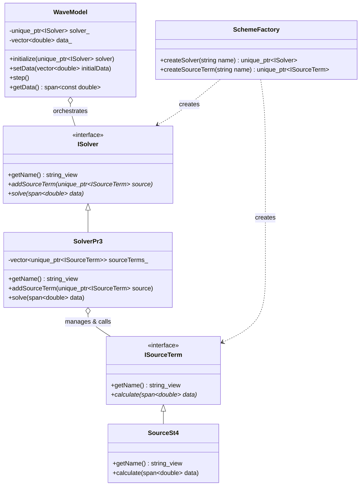

# WAVEWATCH IV Architecture

## Integrated Runtime Solver Selection

WW4 uses an integrated **Strategy** and **Factory** design pattern. To support complex interleaving of physics and dynamics (e.g., implicit sub-stepping), physical source terms are managed and called directly by a **Solver**.

### Key Components

1.  **ISolver**: The primary integration strategy. It defines the contract for numerical solvers that combine dynamics (propagation) and physics (source terms) to advance the model state.
2.  **ISourceTerm**: The physical strategy interface. Implementations (e.g., `SourceSt4`) are injected into the solver.
3.  **SolverPr3**: A concrete solver that manages a collection of source terms and executes them during its `solve` phase.
4.  **SchemeFactory**: Responsible for instantiating individual model components (solvers and source terms).
5.  **WaveModel**: The high-level orchestrator. It manages the simulation loop and triggers the configured solver at each time step.
