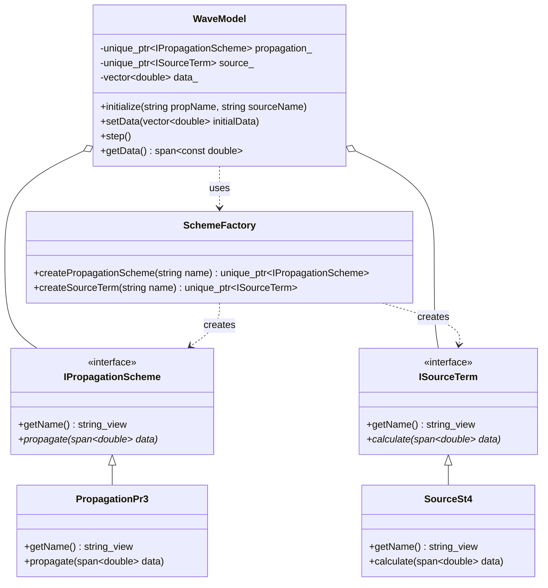

# WAVEWATCH IV Architecture

## Runtime Scheme Selection

WW4 uses the **Strategy** and **Factory** design patterns to enable runtime selection of numerical and physical schemes.

### Key Components

1.  **Interfaces (`IPropagationScheme`, `ISourceTerm`)**: Define the contracts for numerical propagation and physical source term calculations. They use `std::span<double>` to process data in batches, ensuring high performance.
2.  **Concrete Schemes (`PropagationPr3`, `SourceSt4`)**: Specific implementations of the interfaces.
3.  **Scheme Factory**: A centralized registry that instantiates concrete schemes based on string identifiers at runtime.
4.  **Wave Model**: The orchestration engine that manages the lifecycle of selected schemes and executes the simulation loop.
