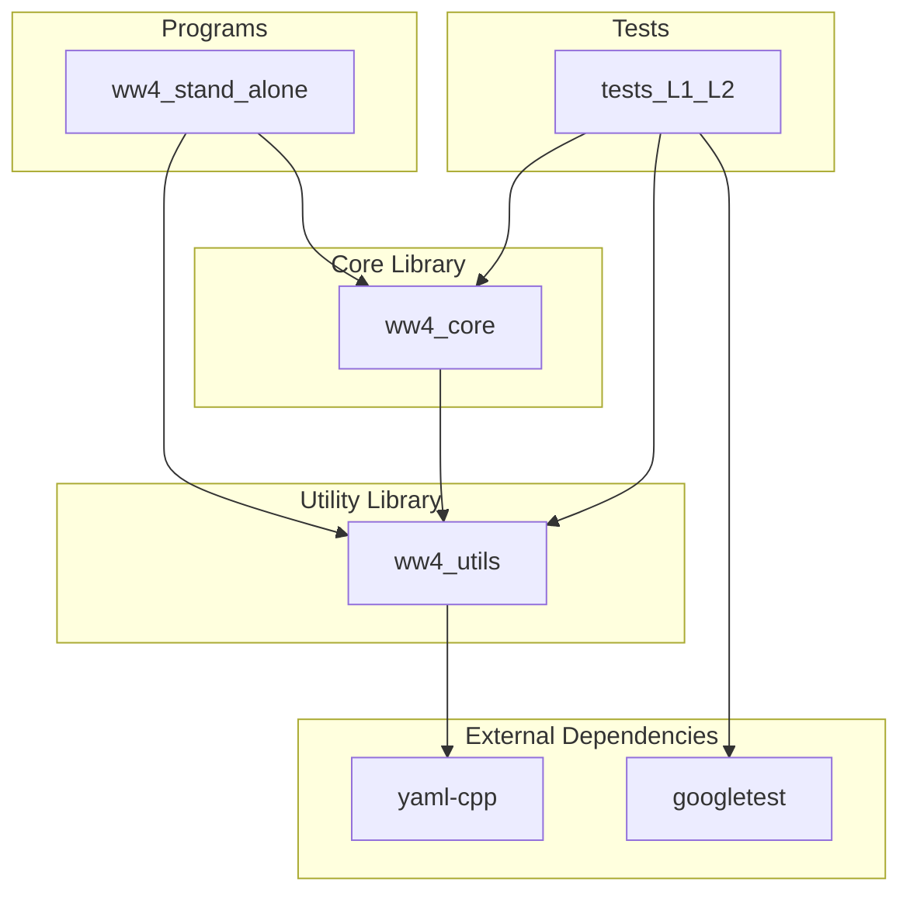

# WAVEWATCH IV Architecture

This document describes the high-level architecture of WAVEWATCH IV (WW4) using a Mermaid diagram.

## Component Diagram

## Description of Components

- **Programs**: Contains end-user applications. `ww4_stand_alone` is a simplified environment for running the wave model core.
- **Core Library (`ww4_core`)**: Implements the main wave model routines, including initialization (`w4core_init`), time stepping (`w4core_wave`), and finalization (`w4core_finl`).
- **Utility Library (`ww4_utils`)**: Provides common functionality such as time management, configuration loading, logging, and standard output utilities.
- **Tests**: Contains unit tests (Level 1) and integration tests (Level 2) using the Google Test framework.
- **External Dependencies**:
    - `yaml-cpp`: Used for parsing YAML configuration files.
    - `googletest`: Used for unit and integration testing.
