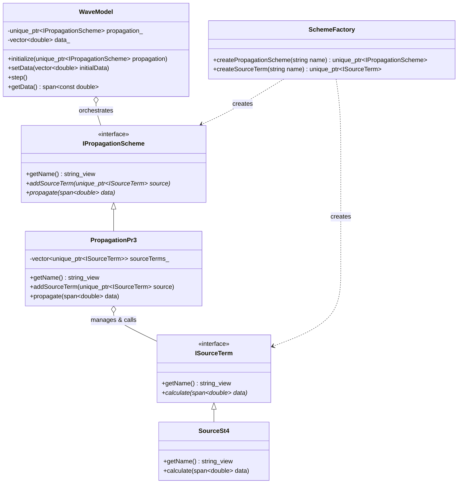

# WAVEWATCH IV Architecture

## Integrated Runtime Scheme Selection

WW4 uses an integrated **Strategy** and **Factory** design pattern. To support complex interleaving of physics and dynamics (e.g., implicit sub-stepping), physical source terms are managed and called directly by the numerical propagation scheme.

### Key Components

1.  **IPropagationScheme**: The primary integration strategy. It defines the contract for numerical propagation and serves as a container for physical source terms.
2.  **ISourceTerm**: The physical strategy interface. Implementations (e.g., `SourceSt4`) are injected into the propagation scheme.
3.  **PropagationPr3**: A concrete propagation scheme that manages a collection of source terms and executes them during its `propagate` phase.
4.  **SchemeFactory**: Responsible for instantiating individual schemes. The assembly of these schemes (e.g., adding ST4 to PR3) happens during model initialization.
5.  **WaveModel**: The high-level orchestrator. It is agnostic of the specific physics-dynamics coupling, simply triggering the `propagate` step of the selected scheme.
