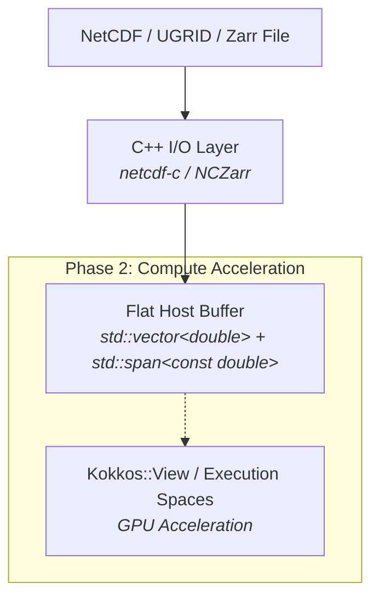
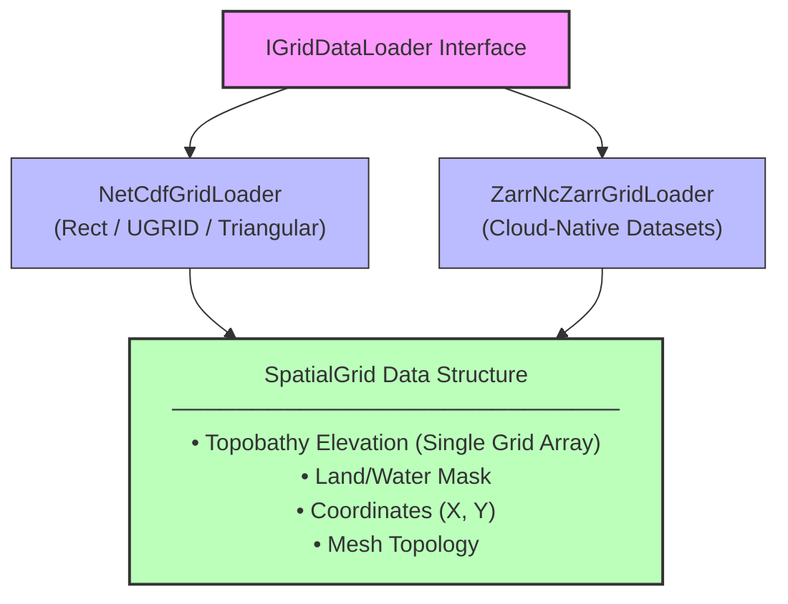

# Architectural Assessment: Ingestion of NetCDF, UGRID, and Zarr Spatial Grids & Topobathy (Bathymetry / Orography) in WAVEWATCH IV (WW4)

## 1. Executive Summary
This assessment presents a strategic roadmap for bringing spatial grid definitions, unstructured meshes (UGRID), cloud-native Zarr datasets, and unified topobathy (bathymetry/orography elevation) fields into WAVEWATCH IV (WW4). The proposal evaluates language runtime choices, existing library ecosystems across NOAA-EMC and the HPC ocean/atmospheric community, performance portability via Kokkos, and single-domain full-grid abstraction layer designs.

---

## 2. Language Choice (Full C++ vs. C++ / Python Hybrid)

### Recommendation: **Full C++ Core with Python Tooling Ecosystem**
* **Core Model (In-Model Grid & Elevation Ingestion): Pure C++20**
  * **Zero Overhead & Operational HPC Readiness:** In high-performance operational environments (e.g., Cray/HPC clusters at NOAA NCEP like Cactus/Dogwood), running Python inside the core numerical iteration loop or during model startup introduces GIL lock risks, non-standard runtime dependencies, and potential multi-threading/MPI interaction issues.
  * **Memory Safety & Control:** Reading large spatial elevation arrays (bathymetry/orography) and connectivity meshes directly into C++ data structures via C/C++ APIs ensures zero-copy vectorization, strict RAII memory management, and `std::span` compatibility.
* **Pre-Processing, Analysis, & Test Generation: Python Tooling**
  * Python (using `xarray`, `netCDF4`, `uxarray`, `zarr`) should be used externally for dataset generation, pre-processing, grid validation, and test dataset generation (e.g., in `tools/` and `tests/`).

---

## 3. Library Evaluation & NOAA-EMC Ecosystem Search

### NOAA-EMC & Community Toolset Landscape
A survey of NOAA-EMC, UFS (Unified Forecast System), and NCEPLIBS repositories indicates the following key patterns:
1. **`NCEPLIBS` / ESMF (Earth System Modeling Framework):** NOAA-EMC relies heavily on ESMF and standard C NetCDF libraries (`netcdf-c`) across UFS components (e.g., `UFS-Weather-Model`, `NEMS`). ESMF provides UGRID/mesh mapping for coupled modeling.
2. **NetCDF-C with NCZarr (Standard NetCDF C Library v4.8.0+):**
   * **Crucial Architecture Finding:** Modern `netcdf-c` includes native support for **NCZarr** (NetCDF4 Zarr backend). This allows C/C++ code calling standard NetCDF APIs to read both traditional NetCDF-4/HDF5 files *and* cloud-native Zarr datasets (via local files, HTTP S3 endpoints, or zip archives) through the exact same C/C++ API without needing separate Zarr libraries!
3. **UGRID Conventions (Unstructured Grid Interchange Format):**
   * Standardized CF-convention extensions for unstructured grids (triangular, polygon, SMC grids).
   * Defines topology variables (`mesh_topology`, `face_node_connectivity`, `edge_node_connectivity`, `node_coordinates`).

### Recommended C++ Library Stack for WW4:
* **Primary I/O Engine:** `netcdf-c` / `netcdf-cxx4` (or a lightweight modern C++20 RAII wrapper around `netcdf-c`).
  * Enables reading NetCDF3, NetCDF4, and Zarr (via NCZarr transparently).
  * Highly optimized, ubiquitous on all HPC modules (`module load netcdf`).
  * Avoids bringing heavy, experimental non-standard C++ Zarr libraries into operational HPC builds.
* **Mesh Topology Abstraction:** Modern C++ structs in `ww4_utils` that parse CF/UGRID metadata attributes (`cf_role = "mesh_topology"`, `node_coordinates`, `face_node_connectivity`).

---

## 4. Performance Portability & Kokkos Evaluation

### Recommendation: **Not Yet for Grid I/O, but Design Data Layouts for Future Kokkos Integration**

* **Is this the time to introduce Kokkos?**
  * **No (for I/O & Grid Parsing):** File I/O and grid parsing are strictly host-side setup routines. Kokkos is designed for compute kernel performance portability (GPUs/CPUs). Introducing Kokkos during grid reading would add significant template complexity, heavy build dependencies, and compiler setup overhead without benefiting I/O.
  * **Yes (for Data Abstraction Design):** While Kokkos should not be linked now, the **memory layout** of spatial grids, elevation fields, and field data must be architected with flat, contiguous allocation patterns (1D/2D contiguity, 64-byte alignment, strided index accessors via `std::span` or `std::mdspan` / C++20/C++23 abstractions).

* **Strategic Transition Path:**



---

## 5. Full-Grid Ingestion Architecture (Single Domain / Full Grid Focus)

Without domain decomposition constraints at this stage, the full-grid ingestion pipeline can be structured cleanly using an abstract grid interface. Bathymetry and orography are ingested as a single, unified topobathy elevation array (where positive values indicate water depth and negative values or explicit datum offsets represent subaerial terrain/orography elevation) rather than separate arrays.



### Key Components:
1. **`SpatialGrid` Struct/Class (`src/ww4_utils/`):**
   * Holds the single, unified spatial elevation array (`elevation` / `topobathy`), containing bathymetry and orography on the single spatial grid.
   * Holds coordinate vectors (`longitude`, `latitude`) and mask arrays (`mask`).
   * For unstructured grids (triangles/SMC), holds connectivity matrices (`node_x`, `node_y`, `elements`).
   * Provides lightweight `std::span` accessors to the core solver engines (`SolverRectangularGrid`, `SolverTriangularGrid`, `SolverSMCGrid`).
2. **`IGridDataLoader` Interface:**
   * Methods: `loadGridGeometry()`, `loadTopobathy()`, `loadMask()`.
3. **YAML Integration in `ww4_run_config.yaml`:**
   ```yaml
   grid:
     type: "netcdf" # options: "netcdf", "ugrid", "zarr"
     file_path: "grids/global_mesh.nc"
     mesh_name: "ww4_mesh"
     variables:
       longitude: "lon"
       latitude: "lat"
       topobathy: "elevation" # Unified single field for bathymetry & orography
       land_mask: "mask"
   ```

---

## 6. Summary & Next Steps Roadmap

1. **Step 1:** Integrate `netcdf-c` dependency into `CMakeLists.txt` (as optional/required dependency behind CMake flags, similar to `WW4_ENABLE_TESTING`).
2. **Step 2:** Define `SpatialGrid` and `IGridDataLoader` structs in `src/ww4_utils/` with C++20 `std::span` memory accessors.
3. **Step 3:** Implement UGRID NetCDF reader capable of handling structured and unstructured grids and topobathy elevation datasets.
4. **Step 4:** Add unit tests using small synthesized NetCDF/NCZarr test files under `tests/ww4_utils/`.
